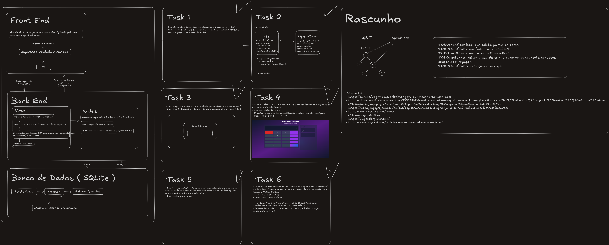

# Desafios encontrados

Para a elaboração deste projeto, foram encontrados alguns desafios ao longo do caminho, sendo eles:
- Entender como seria feito o projeto, para que fosse desenvolvido de forma eficiente e bem estruturada. Dessa forma, foi realizado um estudo sobre qual algoritmo seria utilizado para realizar os cálculos, analisando o critério de segurança.
- Mapear todas as limitações que os templates do **Django** ofereciam para utilizar **JavaScript** como complemento. Assim, foi necessário realizar estudos para entender como alguns *scripts* utilizados com *HTML* funcionavam e como poderiam ser aproveitados.
- Desenvolver a estilização foi um dos maiores desafios deste projeto, pois além de não possuir conhecimento avançado sobre o assunto, foi necessário utilizar funções que ainda não tinha experiência, como por exemplo, linear-gradient e radial-gradient. Porém, este desafio foi superado através de sites que fornecem boa documentação sobre as técnicas de estilização, além de alguns que montam as propriedades das classes automaticamente.

Além desses desafios, para superá-los foi desenvolvido um mapa mental para o projeto, que auxiliou no entendimento da comunicação entre os componentes, por onde começar e onde procurar informações sobre seu funcionamento. Este está disponibilizado abaixo:

